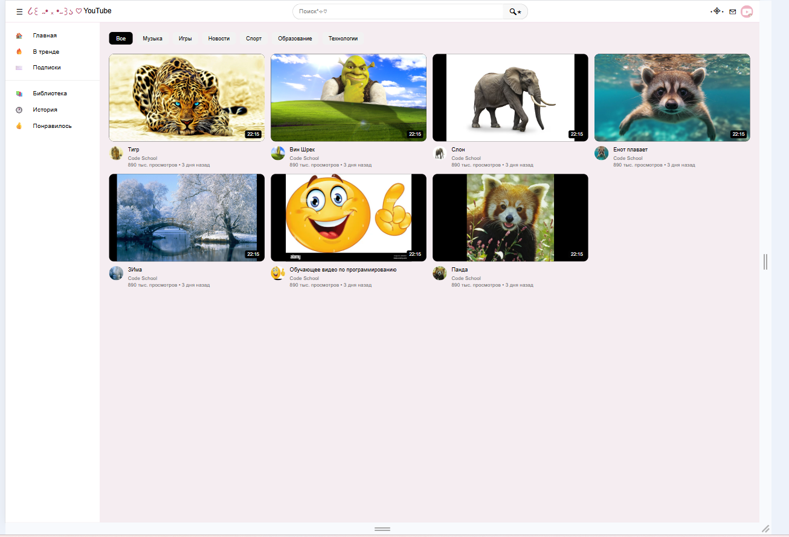
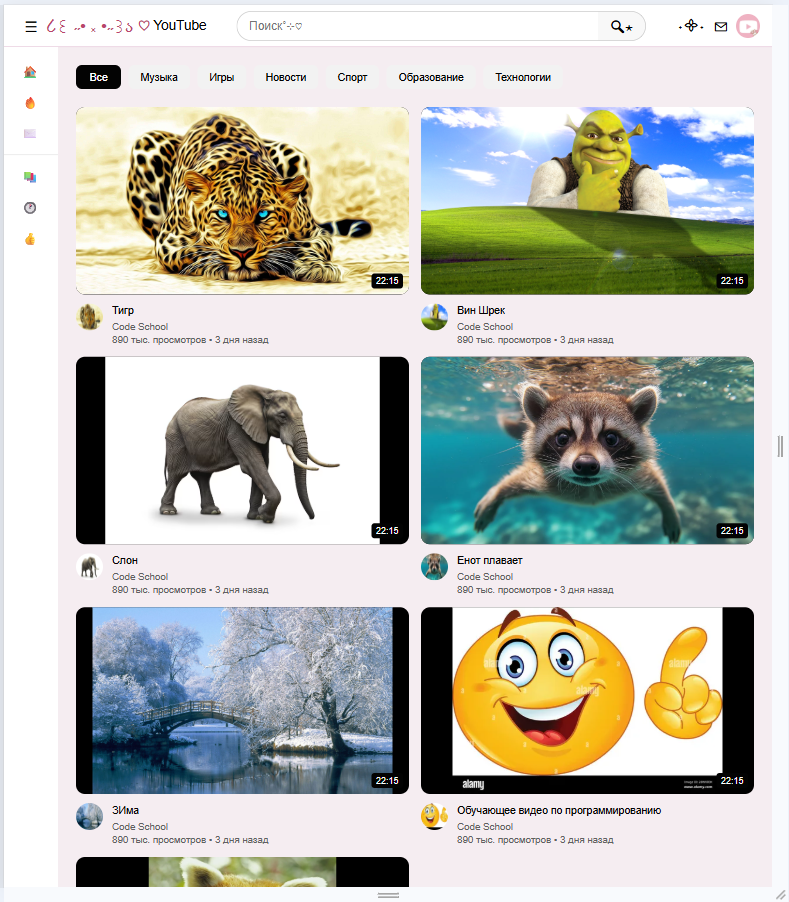
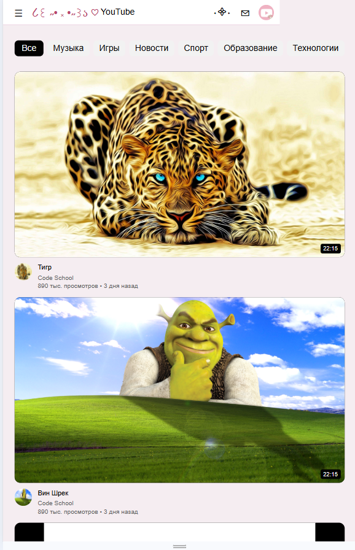

# YouTube Clone - Лабораторная работа №9-10
**Студент:** Кузьмина Диана Александровна
**Группа:** ИСП-232
---
## Описание
Крутой пикми ютуб 👍
---
## Реализованные функции
- [x] Адаптивный хедер с поиском
- [x] Боковая панель навигации
- [x] Категории (чипсы) с интерактивностью
- [x] Сетка видео с карточками
- [x] Hover-эффекты на карточках
- [x] Полная адаптивность под все устройства
- [ ] [Добавьте свои функции]
---
## Технологии
- HTML5
- CSS3
- Flexbox
- CSS Grid
- Media Queries
---
## Скриншоты
### Desktop (1920px)

### Tablet (1024px)

### Mobile (375px)

---
## Как запустить
1. Откройте файл `index.html` в браузере
2. Или используйте **Live Server** в VS Code:
- Установите расширение Live Server
- Правой кнопкой по `index.html` → Open with Live Server
---
## Структура проекта
---
## Вывод
 *Обиды нет. Сделаный **выводы**. Приняты меры. Удачи!*
---
## Дата выполнения
10.02.2026